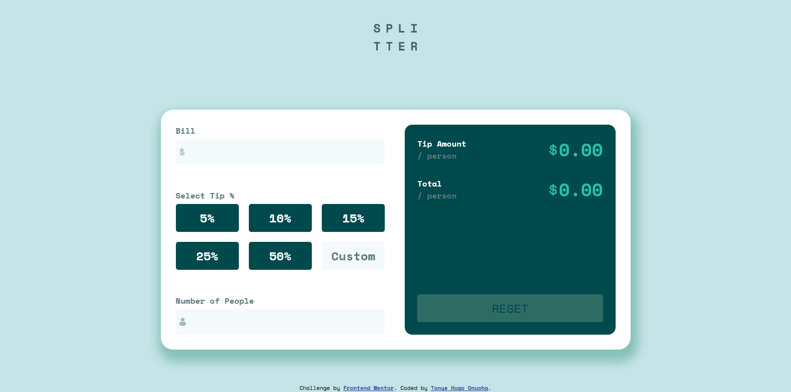

# Frontend Mentor - Tip calculator app solution

This is a solution to the
[Tip calculator app challenge on Frontend Mentor](https://www.frontendmentor.io/challenges/tip-calculator-app-ugJNGbJUX).
Frontend Mentor challenges help you improve your coding skills by building realistic projects.

## Table of contents

-   [Overview](#overview)
    -   [Screenshot](#screenshot)
    -   [Links](#links)
-   [My process](#my-process)
    -   [Built with](#built-with)
    -   [Useful resources](#useful-resources)
-   [Author](#author)

## Overview

This is a simple HTML, CSS, and JavaScript project in which the main objective is to build out a "Tip calculator app".

### Screenshot

### Links

-   Live Site URL: [Vercel](https://tip-calculator-app-mu-sable.vercel.app)

## My process

The process was very straightforward. I started by writing out the stucture of my HTML. I then created a CSS stylesheet
and broke down the styling of elements one piece at a time using the grid and flexbox layout model, while following
mobile-first approach. To complete the layout, I then proceeded to write the media queries for the desktop design. After
the design was completed, I proceeded to add the logic and interactivity of the app using JavaScript.

### Built with

-   Semantic HTML5 markup
-   CSS custom properties
-   Grid layout model
-   Flexbox layout model
-   Media queries
-   JavaScript programming language

### Useful resources

-   [W3Schools](https://www.w3schools.com/)

## Author

-   Email Address - [tonyeonuoha@gmail.com](tonyeonuoha@gmail.com)
